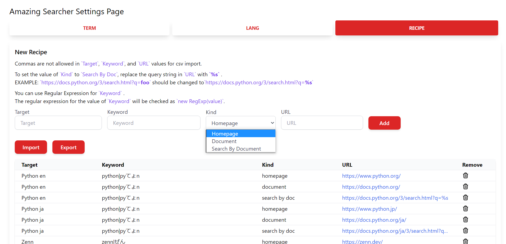

# Amazing Searcher
This is a Chrome Extension that add useful information to Google Search results

## Features
***DEMO:***  

Amazing Searcher adds the following link to the Google search results.
* `Term`: restrict results to a specific time period
* `Lang`: restrict results to a specific language
* `Recipe`: following link about search words.
  * Homepage
  * Document
  * Search By Document (Search in Document by Document)
  * Search By Google (Search in Document by Google)

`Term`, `Lang` and `Recipe` can be set in the options page.  

In particular, by setting up a lot of `Recipe`,
you can greatly reduce the time it takes to get to the information you want!  

## Usage
If you search by Google, you'll be automatically see `Term` and `Lang` links.  
For `Recipe`, the content will be changed depending on the word you search for.  

You can customize the settings by right-clicking extension icon in the toolbar and selecting this extension's `options`.

* Enter the required information and click `Add` to register new data.
* Press the trash icon to remove the data
* `Term` and `Recipe` can import and export data in CSV format

On `RECIPE` tab, there are 3 things to keep in mind:
* Commas are not allowed in `Target`, `Keyword`, and `URL` values for csv import 
* To set the value of `Kind` to `Search By Doc`, replace the query string in `URL` with `%s` 
  * EXAMPLE: `https://docs.python.org/3/search.html?q=foo` should be changed to `https://docs.python.org/3/search.html?q=%s`
* You can use Regular Expression for `Keyword`
  * The regular expression for the value of `Keyword` will be checked as `new RegExp(value)` 

## Installation
Chrome Web Store link is [**Coming Soon**](#)

## Author
[@eetann092](https://twitter.com/eetann092)  
