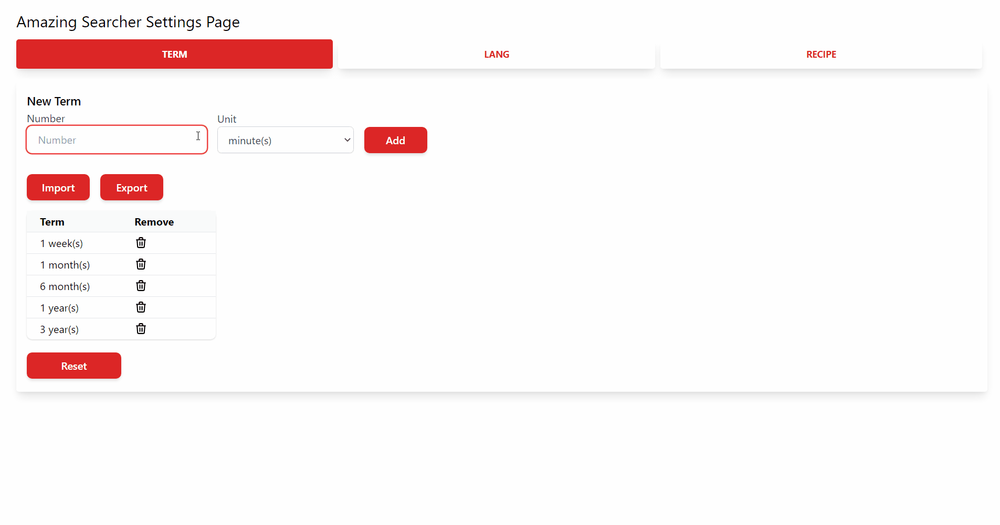
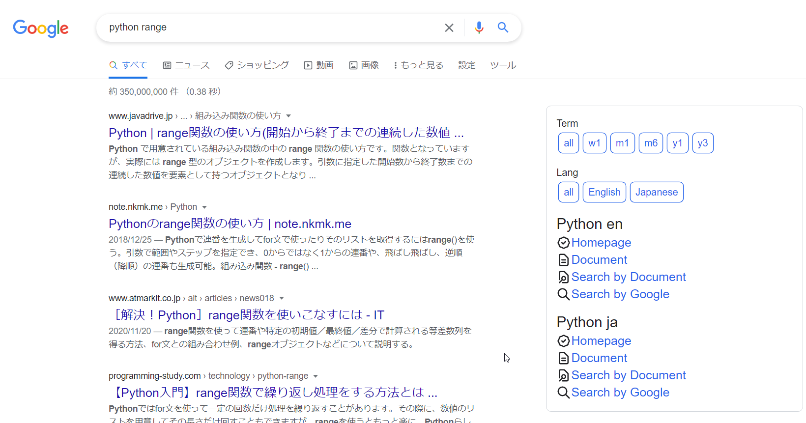

# Amazing Searcher
This is a Chrome Extension that add useful information to Google Search results

## Features
***DEMO:***  

Amazing Searcher adds the following link to the Google search results.
* `Term`: restrict results to a specific time period
* `Lang`: restrict results to a specific language
* `Recipe`: following link about search words.
  * Homepage
  * Document
  * Search By Document (Search in Document by Document)
  * Search By Google (Search in Document by Google)

`Term`, `Lang` and `Recipe` can be set in the options page.  

In particular, by setting up a lot of `Recipe`,
you can greatly reduce the time it takes to get to the information you want!  

## Usage
If you search by Google, you'll be automatically see `Term` and `Lang` links.  
For `Recipe`, the content will be changed depending on the word you search for.  

## Installation
Chrome Web Store link is [**Coming Soon**](#)

## Author
[@eetann092](https://twitter.com/eetann092)  
