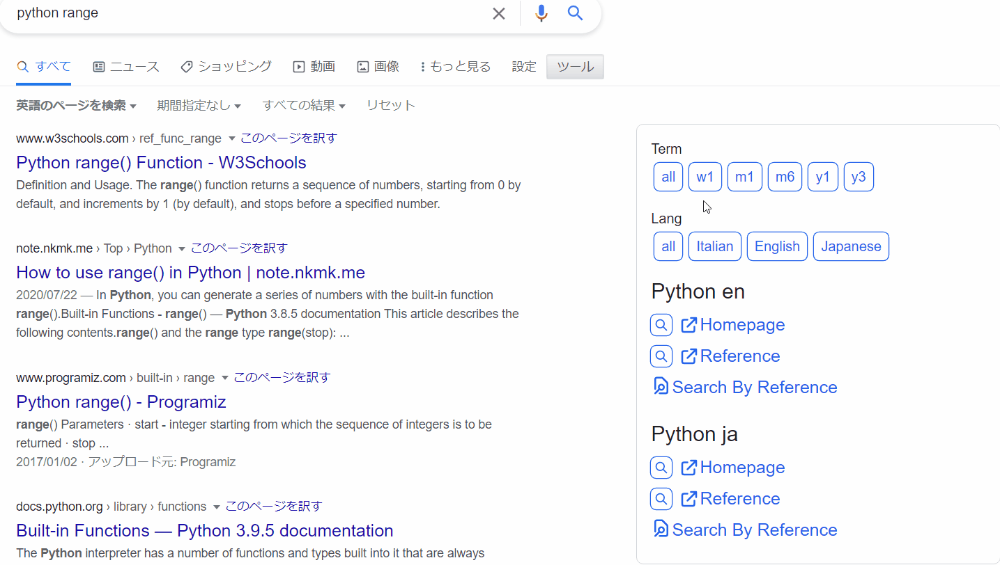
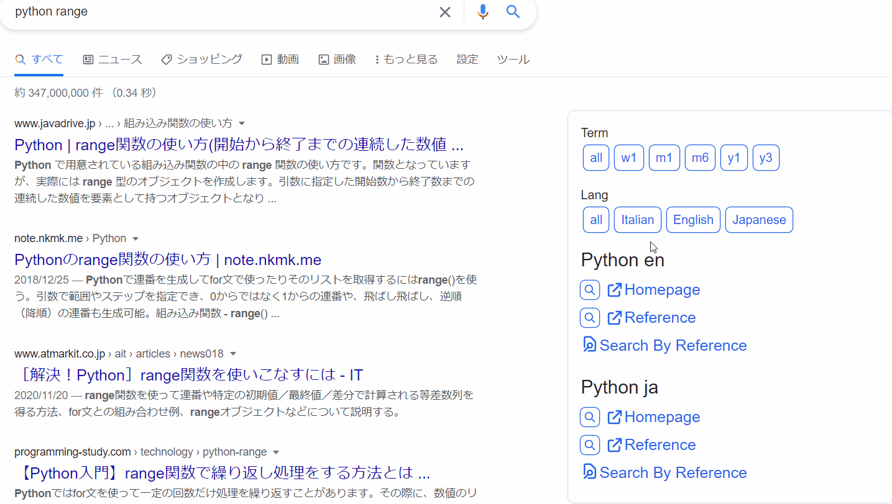
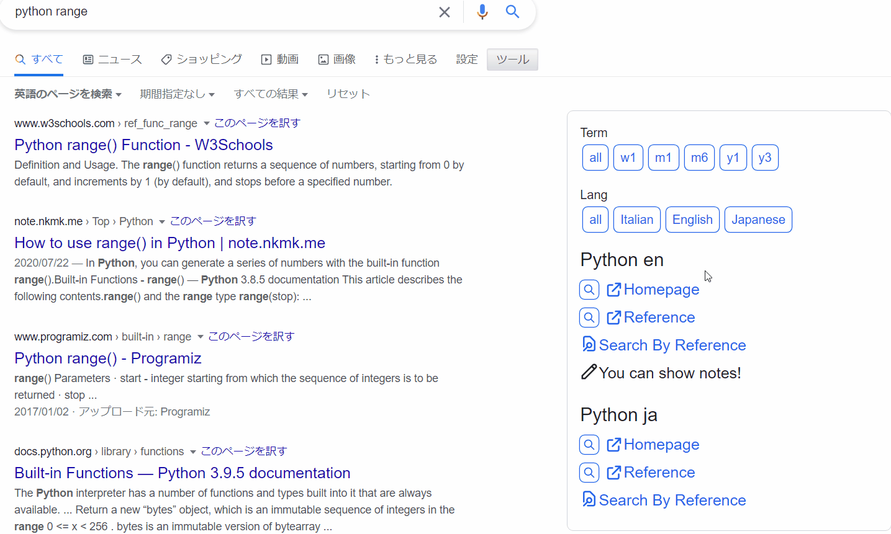
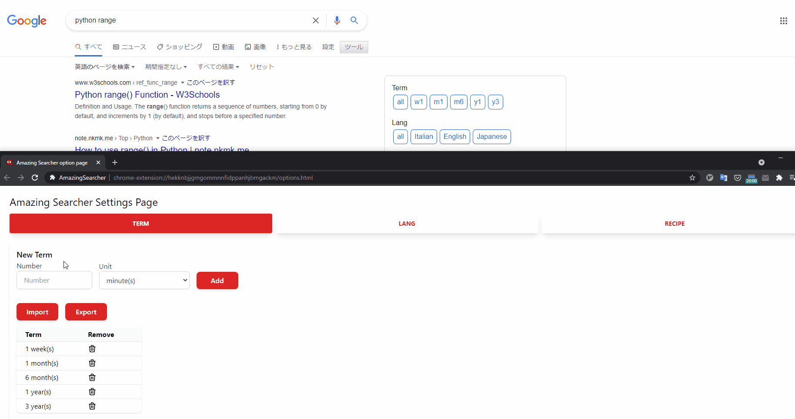
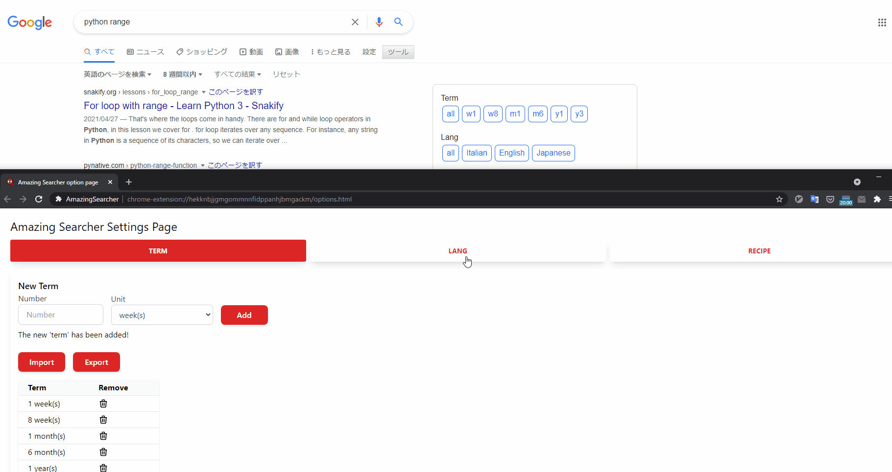
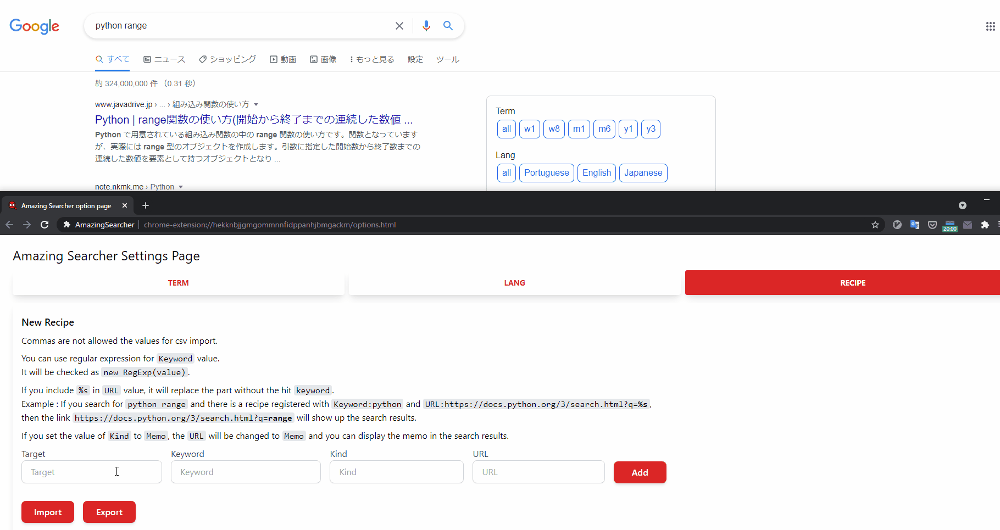

# Amazing Searcher
This is a Chrome Extension that add useful information to Google Search results

## Features
Amazing Searcher adds the following link to the Google search results.
* `Term`: restrict results to a specific time period
* `Lang`: restrict results to a specific language
* `Recipe`: following link about search words.
  * Homepage
  * Reference
  * Search By Reference (Search in Reference by Reference)
  * Search By Google (Search in Reference by Google)
  * The link you registered on the settings page
  * The Memo you registered on the settings page

DEMO `Term`:  

DEMO `Lang`:  

DEMO `Recipe`:  

`Term`, `Lang` and `Recipe` can be set in the options page.  

DEMO set `Term`:  

DEMO set `Lang`:  

DEMO set `Recipe`:  

In particular, by setting up a lot of `Recipe`,
you can greatly reduce the time it takes to get to the information you want!  

## Usage
If you search by Google, you'll be automatically see `Term` and `Lang` links.  
About `Recipe`, the content will be changed depending on the word you search for.  

You can customize the settings by right-clicking extension icon in the toolbar and selecting this extension's `options`.

* Enter the required information and click `Add` to register new data.
* Press the trash icon to remove the data
* `Term` and `Recipe` can import and export data in CSV format!

On `RECIPE` tab, there are 3 things to keep in mind:
* Commas are not allowed the values for csv import.
* You can use regular expression for `Keyword` value.
  * It will be checked as `new RegExp(value)`.
* If you set the value of Kind to Memo, the `URL` will be changed to `Memo` and you can display the memo in the search results.
* If you include `%s` in URL value, it will replace the part without the hit keyword.

### `%s` Example:  
If you search for `python range`  
and there is a recipe registered with

* `Keyword:python`  
* `URL:https://docs.python.org/3/search.html?q=%s`  

then the link `https://docs.python.org/3/search.html?q=range` will show up the search results.

## Installation
Chrome Web Store link is [**Coming Soon**](#)

## Author
[@eetann092](https://twitter.com/eetann092)  
